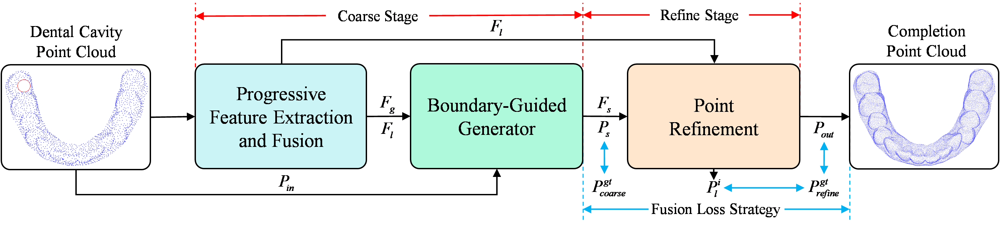
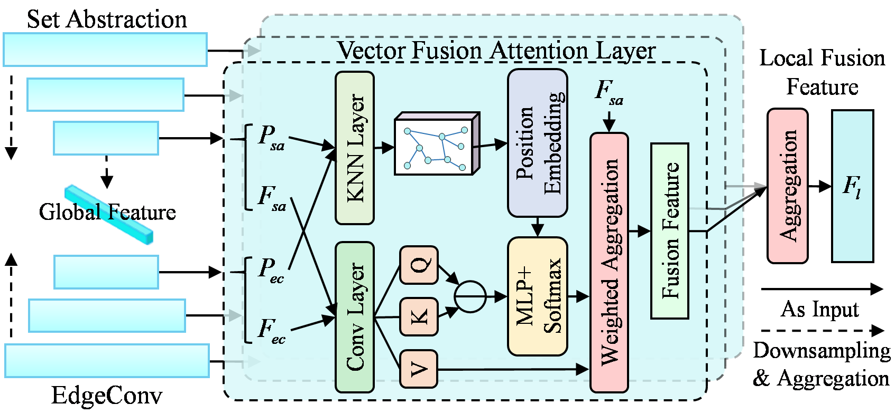
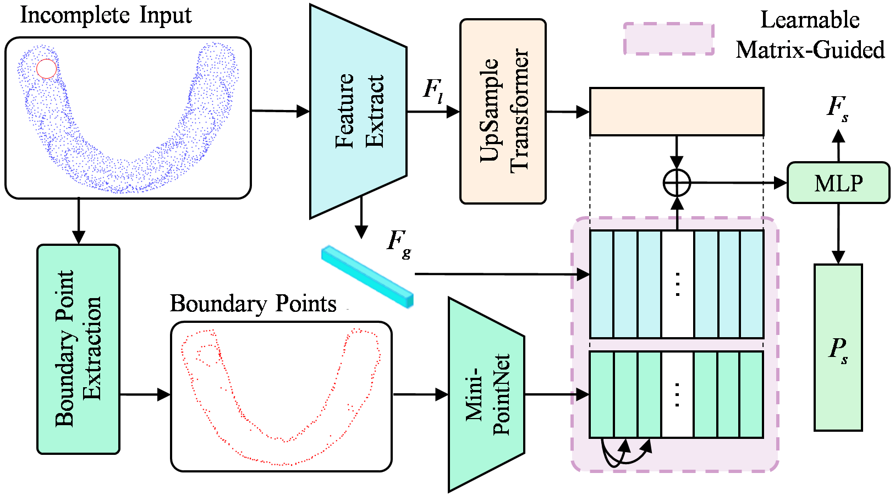
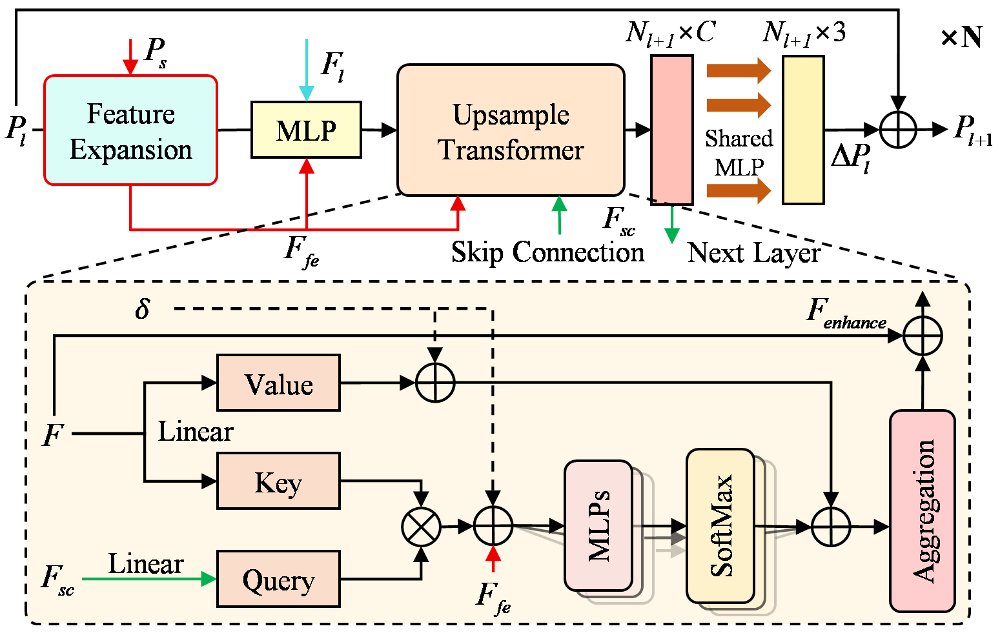

# 🦷 ProFound: Progressive Fusion Feature and Boundary-Guidance for Teeth Point Cloud Completion

Created by Hui Liu, Yaodong Chen, Kaiyue Bi, Fucheng Niu, Zekuan Yu, Lin Zhang 

This repository contains PyTorch implementation for **ProFound**.

## 🧭 Overview

With the widespread application of 3D oral scanning in dentistry, teeth point cloud completion has emerged as a digital diagnostic and therapeutic aid, providing new solutions for dentists in tasks such as tooth morphology reconstruction and defects. 

However, research specifically targeting teeth point cloud completion remains relatively limited and the generic point cloud completion model has limitations in global and local information capture, missing position perception, and point distribution in dental data. 

To address this issue,  we introduce a specialized teeth point cloud completion network, named **ProFound**. First, we propose the **Progressive Feature Extraction and Fusion** module, which effectively combines the strengths of two feature extraction pipelines to fully capture local detail information while preserving the integrity of the global geometric structure. Secondly, we design the **Boundary-Guided Generator** module, which enhances the model's ability to perceive missing regions by incorporating boundary prior information from the input point cloud. Moreover, considering the characteristics of existing completion frameworks and loss functions, we propose the **Hybrid Loss Strategy**, which effectively mitigates the point aggregation and optimizes the point distribution. Furthermore, we extended the baseline TUCNet dental dataset and conducted extensive experiments on the newly constructed **FID-Comp3D dataset**. 

Experimental results demonstrate that ProFound significantly outperforms existing general-purpose and dental-specific completion models on the benchmark tests. 

### 📌 Framework


#### Progressive Feature Extraction and Fusion
<p align="center">
  
</p>

#### Boundary-Guided Generator
<p align="center">
  
</p>

#### Point Refinement
<p align="center">
  
</p>

## 🚀 Usage

### Requirements

- PyTorch >= 1.10.1
- python >= 3.7
- CUDA >= 11.3
- GCC >= 4.9 
- open3d >= 0.9.0
- openCV
- torchvision
- timm
- tensorboardX

```
pip install -r requirements.txt
```

#### Building Pytorch Extensions for Chamfer Distance, PointNet++ and kNN

*NOTE:* PyTorch >= 1.7 and GCC >= 4.9 are required.

```
# Chamfer Distance
cd extensions/chamfer_dist
python setup.py install

cd ../Chamfer3D
python setup.py install

# EMD
cd ../emd
python setup.py install
```

```
# PointNet++
pip install "git+https://github.com/erikwijmans/Pointnet2_PyTorch.git#egg=pointnet2_ops&subdirectory=pointnet2_ops_lib"
# GPU kNN
pip install --upgrade https://github.com/unlimblue/KNN_CUDA/releases/download/0.2/KNN_CUDA-0.2-py3-none-any.whl
```


### Dataset

If needed, please contact: [Lin Zhang](mailto:lin.zhang@cumt.edu.cn).

### Pretrained Models
You can download the pretrained models from the following links: [ProFound-ckpt-best](https://pan.baidu.com/s/1SNwTRPtH9UB5kbkhO7A0Uw=4aqu).

### Training

To train a point cloud completion model from scratch, run:

```
# Use DataParallel
bash ./scripts/train.sh <GPUIDS> \
    --config <config> \
    --exp_name <name> \
    [--resume] \
    [--start_ckpts <path>] \
    [--val_freq <int>]
```

Train a ProFound model on FID-Com3D benchmark with 2 gpus:
```
bash ./scripts/dist_train.sh 0,1 \
    --config ./cfgs/FID_Com3D_models/ProFound.yaml \
    --exp_name example
```

### Evaluation

To evaluate a pre-trained ProFound model on the Dataset with single GPU, run:

```
bash ./scripts/test.sh <GPU_IDS>  \
    --ckpts <path> \
    --config <config> \
    --exp_name <name> \
```

Test the ProFound pretrained model on the FID-Com3D benchmark:
```
bash ./scripts/test.sh 0 \
    --ckpts ./pretrained/ckpt_best.pth \
    --config ./cfgs/FID_Com3D_models/ProFound.yaml \
    --exp_name example
```

### Inference

To inference sample(s) with pretrained model

```
python tools/inference.py \
${CONFIG_FILE} ${CHECKPOINT_FILE} \
[--pc_root <path> or --pc <file>] \
[--save_vis_img] \
[--out_pc_root <dir>] \
```

For example, inference all samples under `demo/` and save the results under `inference_result/`
```
python tools/inference.py \
./cfgs/FID_Com3D_models/ProFound.yaml ./ckpts/ckpt_best.pth \
--pc_root demo/ \ 
--save_vis_img  \
--out_pc_root inference_result/ \
```

## ⚖️ License
MIT License

## 🤝 Acknowledgements

Our code is inspired by [PoinTr](https://github.com/yuxumin/PoinTr), [SnowFlakeNet](https://github.com/AllenXiangX/SnowflakeNet) and [SeedFormer](https://github.com/hrzhou2/seedformer).  

We sincerely acknowledge the authors of [TUCNet](https://www.sciencedirect.com/science/article/abs/pii/S0010482523009848) for making part of their source code publicly available, which served as an important reference for the implementation of our method. 


## 📚 Citation
If you find our work useful in your research, please consider citing: 
```
@inproceedings{
  title={Progressive Fusion Feature and Boundary-Guidance for Teeth Point Cloud Completion},
  author={Hui Liu, Yaodong Chen, Kaiyue Bi, Fucheng Niu, Zekuan Yu, and Lin Zhang },
  year={2025}
}
```

